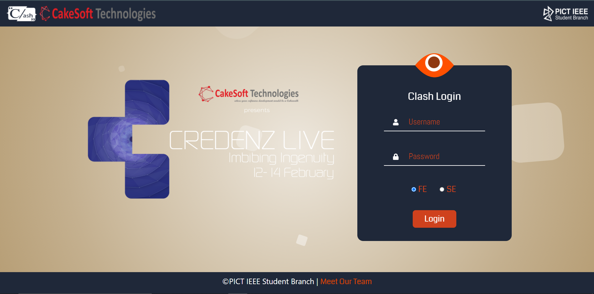
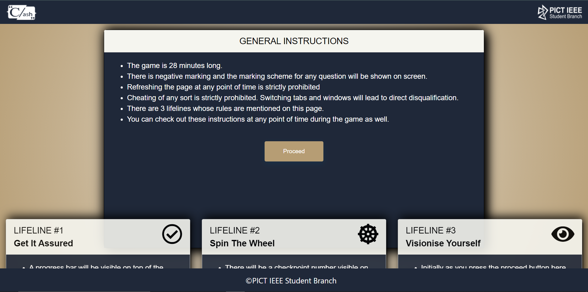
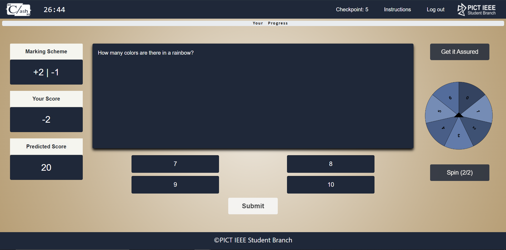
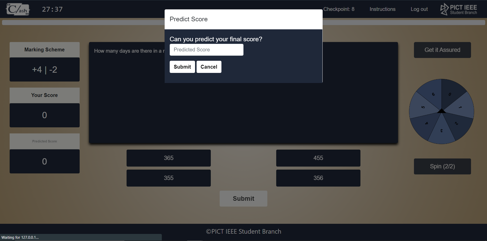
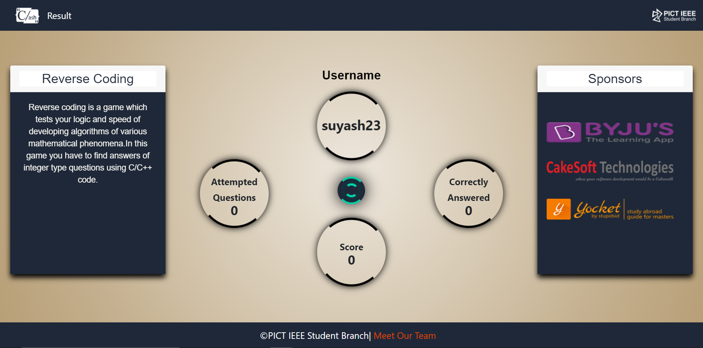

# CLASH CREDENZ 20'

### Working project of Clash which is a technical MCQ based event in Credenz organised by PICT IEEE Student Branch

## Steps to run project:

* To install pip: (Ubuntu)
```sh 
$ sudo apt install python3-pip
```
* Follow [this link](https://pip.pypa.io/en/stable/installing/) for installation of pip in windows
* To install virtualenv: 
```sh 
$ sudo pip3 install virtualenv
```
* To start virtualenv: 
```sh 
$ virtualenv venv
```
OR
* In windows to make a venv:
```sh
$ py -m venv venv
```
* To activate virtualenv: 
```sh 
source venv/bin/activate
```
OR
```sh
$ venv\Scripts\activate
```
* To deactivate virtualenv: 
```sh 
$ deactivate
```
* To install requirements and run project: 
    1. Activate virtualenv
    2. To install dependencies required **pip3 install -r requirements.txt**
    3. Run **python manage.py makemigrations**
    4. Run **python manage.py migrate** to make migrations
    5. Add a few questions in the database to see functioning
    6. To run clash **python manage.py runserver**
    7. Enjoy!

## Technology Used:

* **Front end:**
  1. HTML5
  2. CSS3
  3. Javascript and AJAX
  
* **Back end:**
  1. Django 3.1.0 (Python web framework)
 
* **Database used:**
  1. SQLite3
 
## Modules Used:

* User authentication
* Timer
* Conditional controlling of HTML elements
* Tab change handling (to prohibit copy)
* 8 lifelines were applied as follows :
``` 
   1. Reattempting a question
   2. -5 from the total score 
   3. Freezing time
   4. -8 +4 marking scheme for the questions
   5. No negative marking for next 3 Questions
   6. No spin here after
   7. +16 -10 marking scheme for the current question
   8. And last one was get assured which allows user to mark 2 answers for same question if he is not sure about it.
```
## Snippets of the project:

### 1. Login page


### 2. Instruction page


### 3. Questions page


### 4. Predict Score page


### 5. Result Page


